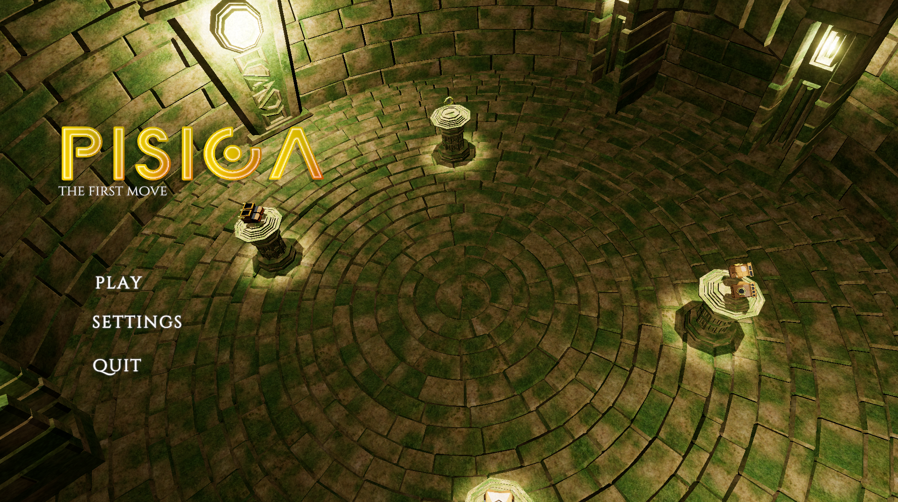
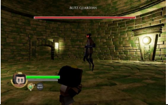
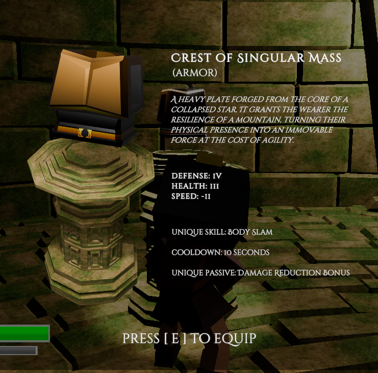
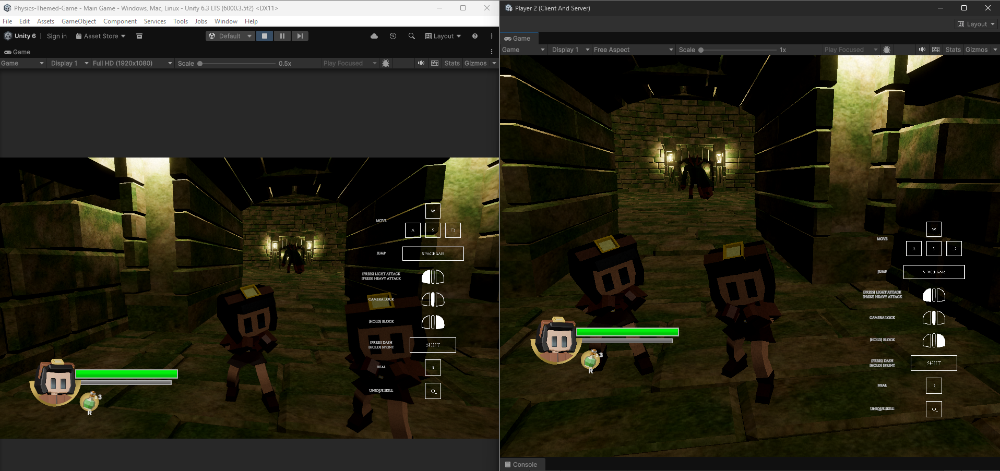

# 🎮 PISICA – Multiplayer Soulslike Game

## 📖 Description

PISICA is a multiplayer Soulslike game developed as an academic team project using Unity. The project focuses on multiplayer gameplay, combat mechanics, and collaborative game development using GitHub.

---

## 🛠️ Technologies Used

- Unity
- C#
- Unity Netcode for GameObjects
- Shader Graph
- Particle System
- GitHub

---

## 👨‍💻 My Contributions

As a member of the development team, I contributed to the following:

- Implemented player movement mechanics
- Integrated player and enemy HP bars
- Added and configured sound effects (SFX)
- Created visual effects (VFX) and tested them during development.
- Assisted in multiplayer testing
- Debugged gameplay features
- Collaborated with teammates using GitHub

---

## 👥 Team Project

This game was developed collaboratively as an academic team project. The contributions listed above represent my individual work on the project.

---
## 🎯 Learning Outcomes

Through this project, I gained experience in:

- Unity game development
- C# scripting
- Multiplayer game development
- Version control using GitHub
- Team collaboration
- Debugging and testing
  
  ---

## 🎮 Game Poster

---
## 📸 Screenshots
---
## 🎮 Main Menu

## ⚔️ Combat

## 🛡️ Equipment

## 👹 Enemy Battle

## 🌐 2 player 

---
## 🎥 Gameplay Video

▶️ Watch the gameplay here:
https://youtu.be/dPPfn3QaPIg

## 🎥 VFX Showcase
This video demonstrates a visual effect that I created and tested during the development of PISICA. While it was not integrated into the final multiplayer build, it represents my contribution to the project's visual effects development.

https://youtu.be/gi2lEr4KpyI
---
## 🚀 Status

✅ Academic Project Completed
